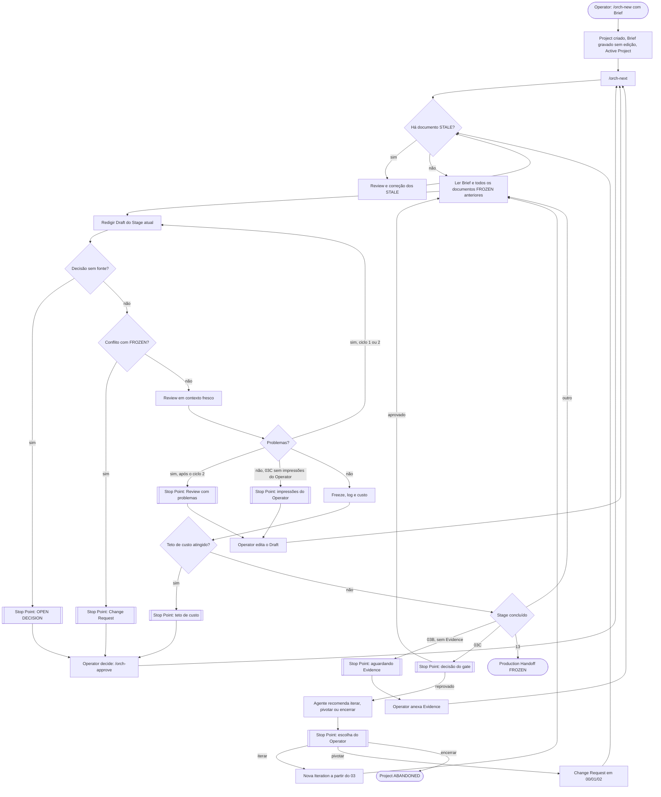

# 01 — OrchDocs PRD

Status: DRAFT · Segundo na hierarquia de `docs/orchdocs/`: Constitution > **PRD** > TRD > Pipeline Spec > Implementation Plan.
Fonte: `00_CONSTITUTION.md` (FROZEN). Em conflito, a Constitution vence. Os termos seguem `CONTEXT.md`.

Este PRD descreve **comportamento**. Framework, stack, formato de estado e caminhos exatos ficam para o TRD e a Pipeline Spec.

**Convenção de origem.** "Const. Dn", "Pn" e "An" são itens da Constitution. "Const. §4.n" é o item n da Decision Policy e "Const. §6" são os Non-goals. "Qn" é a decisão do Operator na entrevista deste PRD (§10). Referências sem o prefixo "Const." apontam para seções deste PRD.

## 1. Problema e objetivo

### Problema

O Operator tem a ideia bruta de um jogo e precisa de um pacote de pré-produção coerente antes de produzir. Escrever esse pacote com um assistente de chat, prompt por prompt, causa três falhas:

- **Drift**: um documento posterior contradiz um anterior, e ninguém percebe.
- **Decisões inventadas**: o assistente preenche lacunas do Brief como se fossem decisões do Operator.
- **Perda de contexto**: depois de dias parado, não se sabe em que Stage se estava, o que falta decidir nem quanto já se gastou.

### Objetivo

Levar um Brief até o 13 Production Handoff pelo pipeline fixo de Const. D5, um documento por vez (P1). Cada decisão aponta para a sua fonte (P2), nenhum documento anterior é contradito sem Change Request (P3), o Operator decide só o que é dele (P4) e nada técnico acontece antes do gate 03C com Evidence (P5).

## 2. Operator e cenários

Um único Operator (Const. D1). Não há papéis, permissões nem colaboração (Const. §6).

| # | Cenário | Resultado esperado |
|---|---------|--------------------|
| S1 | O Operator tem uma ideia nova e cria um Project com o Brief. | O Project existe, o Brief é gravado sem alteração e o Project vira o Active Project. |
| S2 | O Operator pede para avançar. | O agente redige, revisa e congela Stages em sequência até o primeiro Stop Point. |
| S3 | O Operator volta depois de dias. | Ele vê Stage, status dos documentos, o que falta decidir, o custo e o resumo da última sessão, e continua sem retrabalho. |
| S4 | O agente encontra uma decisão sem fonte. | Registra `OPEN DECISION`, para e espera o Operator. |
| S5 | O protótipo foi jogado e há Evidence. | O agente redige o 03C, o Operator escreve as impressões e decide o gate. |
| S6 | O gate é reprovado. | O agente recomenda iterar, pivotar ou encerrar; o Operator escolhe. |
| S7 | O Operator muda de ideia sobre um documento FROZEN. | Abre um Change Request, vê o impacto e confirma ou desiste. |
| S8 | O agente encontra um conflito com um documento FROZEN. | Para o Stage e abre um Change Request para o Operator decidir. |

## 3. Jornada principal

## 4. Requisitos funcionais

Cada requisito cita a sua origem (ver a convenção no topo). "Critério" diz como verificar o requisito.

### 4.1 Criação do Project

- **REQ-001** — MUST criar um Project a partir de um slug e de um Brief (texto colado ou arquivo) e gravar o Brief sem nenhuma alteração. _Origem: Const. D4; Q1._ Critério: o conteúdo gravado é idêntico, byte a byte, à entrada.
- **REQ-002** — MUST recusar a criação quando o slug já existe e MUST NOT alterar o Brief de um Project existente. _Origem: Const. D4._ Critério: a tentativa falha e o Brief continua idêntico.
- **REQ-003** — MUST NOT entrevistar o Operator nem reescrever o Brief na criação; as lacunas do Brief viram `OPEN DECISION` no 00 Game Constitution. _Origem: Const. D4 (Brief imutável, do Operator), A4; Q1._ Critério: a criação não faz perguntas e o Brief é idêntico à entrada; um Brief de teste com uma lacuna conhecida gera a OPEN DECISION correspondente no 00.
- **REQ-004** — COULD aceitar, na criação, imagens de referência do Operator como anexos do Brief, com a mesma imutabilidade do Brief. _Origem: Const. D4; Q17._ Critério: os anexos ficam no Project e o conteúdo deles não muda depois.
- **REQ-005** — MUST permitir vários Projects com um único Active Project. A criação torna o novo Project ativo, e todo comando que age num Project aceita um slug opcional que sobrepõe o ativo. _Origem: Const. D1 (um Operator, sem limite de Projects); Q9._ Critério: com dois Projects, um comando sem slug age no ativo e um comando com slug age no indicado.

### 4.2 Avanço pelo pipeline

- **REQ-006** — MUST executar os Stages na ordem de Const. D5, sem pular nenhum; o Draft de um Stage só pode ser criado quando todos os anteriores estão FROZEN. _Origem: Const. D5, A2, A3._ Critério: no log, a criação de cada Draft vem depois do Freeze de todos os Stages anteriores.
- **REQ-007** — MUST produzir exatamente um documento por Stage em cada Iteration. _Origem: P1, Const. A2._ Critério: cada par (Stage, Iteration) tem um único documento.
- **REQ-008** — MUST ler o Brief e todos os documentos FROZEN anteriores do Project antes de redigir um Draft. _Origem: P1._ Critério: a entrada de log da criação do Draft lista as fontes lidas, e a lista é igual ao conjunto de FROZEN anteriores mais o Brief.
- **REQ-009** — SHOULD, a cada chamada de avanço, redigir, revisar, congelar e seguir Stage após Stage sem pedir aprovação, até o próximo Stop Point. _Origem: Const. D11; Q2._ Critério: com fontes completas e Reviews limpas, uma chamada avança mais de um Stage.
- **REQ-010** — SHOULD oferecer uma opção de avanço limitada a um único Stage. _Origem: Const. D11; Q2._ Critério: com a opção, no máximo um Stage vai para FROZEN.
- **REQ-011** — MUST parar e consultar o Operator nos Stop Points abaixo. Nenhum Freeze acontece depois de um Stop Point até que o Operator aja. _Critério geral: em cada caso, o avanço termina e o Stop Point aparece no status._
  - (a) OPEN DECISION a resolver. _Origem: Const. D12._
  - (b) Decisão do gate 03C. _Origem: Const. D9, D12._
  - (c) Change Request a aprovar ou rejeitar. _Origem: Const. D12._
  - (d) Teto de custo atingido. _Origem: Const. D12._
  - (e) Review que ainda tem problemas depois de 2 ciclos de correção (REQ-021). _Origem: Const. D11; Q3._
  - (f) 03B FROZEN sem Evidence na Iteration atual (REQ-034). _Origem: Const. D8, D9; Q11._
  - (g) Seção de impressões do Operator vazia no 03C (REQ-036). _Origem: P4, Const. A4; Q10._
  - (h) Escolha entre iterar, pivotar ou encerrar depois da reprovação do gate (REQ-039). _Origem: Const. D10._
- **REQ-012** — MUST registrar como `OPEN DECISION: <pergunta>` toda decisão ausente nas fontes, sem preenchê-la. _Origem: Const. A4._ Critério: com um Brief de teste com uma lacuna conhecida, o documento traz a OPEN DECISION correspondente, e nenhum valor para ela aparece no texto.
- **REQ-013** — MUST fazer cada decisão de um documento citar a sua fonte, no formato de citação que o Stage Contract define (PRD-OD6). As fontes válidas são o Brief, um documento anterior (com a seção) ou uma Evidence, além da decisão do Operator registrada no documento, que depende de CR-001. _Origem: P2; CR-001._ Critério: a checagem mecânica conta zero decisões sem citação.
- **REQ-014** — MUST marcar como `N/A — <justificativa>` a seção que não se aplica ao jogo, com a justificativa rastreável ao Brief ou a um documento anterior. _Origem: Const. D6._ Critério: toda seção N/A tem uma justificativa com citação.
- **REQ-015** — MUST escrever a prosa em português e manter em inglês os termos do `CONTEXT.md`, as palavras-chave, os status e os identificadores. _Origem: Const. D3._ Critério: nenhum termo do glossário, palavra-chave (MUST, SHOULD, COULD, OPEN DECISION, N/A) ou status aparece traduzido (por exemplo, "DEVE", "CONGELADO", "Rascunho" como status).
- **REQ-016** — MUST recusar produzir documentos fora do pipeline de Const. D5. _Origem: Const. A1._ Critério: um pedido de pitch deck ou business plan é recusado, e nenhum documento é criado.
- **REQ-017** — O 13 Production Handoff MUST ser apenas um documento no Project; o OrchDocs MUST NOT criar repositórios, código, issues ou harness de produção. _Origem: Const. D7._ Critério: depois do Freeze do 13, não existe nenhum repositório, arquivo de código, issue ou harness novo.
- **REQ-018** — SHOULD usar Claude Opus 5.5 na redação e na Review; COULD usar Claude Sonnet 5.5 nas checagens mecânicas. _Origem: Const. D14._ Critério: o log registra o modelo de cada operação.

### 4.3 Review

- **REQ-019** — MUST fazer uma Review em contexto fresco, sem o histórico da redação, antes de cada Freeze. _Origem: Const. D11._ Critério: todo Freeze tem uma Review registrada depois da última alteração do Draft.
- **REQ-020** — A Review MUST aplicar dois conjuntos de verificação:
  - **Checagens mecânicas**: seções exigidas pelo Stage Contract, citação em cada decisão (REQ-013), justificativa em cada N/A (REQ-014) e forma das palavras-chave e dos termos (REQ-015).
  - **Rubrica genérica**: coerência com os documentos anteriores e ausência de contradição com FROZEN, completude diante do Stage Contract, requisitos testáveis e nenhuma decisão inventada.

  O resultado é uma lista de problemas com severidade (HIGH, MEDIUM ou LOW). Qualquer problema, de qualquer severidade, impede o Freeze sem decisão do Operator. _Origem: P2, P3, Const. D3, D6, D11, A4, §4.1; Q18._ Critério: o relatório de Review tem o resultado de cada checagem e cada item da rubrica, e nenhum Freeze tem como última Review uma lista de problemas não vazia.
- **REQ-021** — Quando a Review aponta problemas, o agente MUST corrigir o Draft e revisar de novo, até 2 ciclos de correção. Se ainda houver problemas, MUST parar no Stop Point (e) com o relatório. As saídas desse Stop Point são PRD-OD8. _Origem: Const. D11; Q3._ Critério: nenhum documento tem mais de 2 ciclos de correção automáticos antes do Stop Point (e).
- **REQ-022** — MUST permitir ao Operator pedir uma Review de qualquer documento a qualquer momento; essa Review só gera um relatório e MUST NOT mudar status. _Origem: P4, Const. D11; Q4._ Critério: os status são iguais antes e depois do pedido.

### 4.4 Decisões do Operator

- **REQ-023** — MUST permitir ao Operator registrar a sua decisão no Stop Point atual. Os casos são:
  - resolver uma OPEN DECISION;
  - aprovar ou reprovar o gate;
  - escolher iterar, pivotar ou encerrar;
  - aprovar ou rejeitar um Change Request;
  - continuar depois do teto de custo.

  _Origem: P4, Const. D12; Q4._ Critério: cada decisão tira o Project do Stop Point correspondente e aparece no log com o autor Operator.
- **REQ-024** — A resolução de uma OPEN DECISION MUST ser gravada no próprio documento, no lugar da OPEN DECISION, marcada como decidida pelo Operator com a data. Os documentos posteriores citam esse documento como fonte. _Origem: P2, P4, Const. A4; Q5; depende de CR-001._ Critério: o documento não tem mais essa OPEN DECISION, e a marca com data está no lugar dela.
- **REQ-025** — Enquanto um documento está em DRAFT, o Operator pode editá-lo direto. O agente MUST registrar a edição no log como decisão do Operator, MUST NOT revertê-la e MUST refazer a Review antes do Freeze. Se a Review apontar problema na edição, o agente MUST parar no Stop Point (e), sem corrigir o trecho editado. _Origem: P4, Const. D11; Q8._ Critério: a edição manual persiste no FROZEN, existe uma entrada de log de edição do Operator e existe uma Review posterior à edição.
- **REQ-026** — MUST NOT alterar um documento FROZEN a não ser por um Change Request aprovado. _Origem: P3, Const. §4.1–§4.4._ Critério: uma escrita direta num FROZEN é bloqueada.
- **REQ-027** — Nos documentos de `docs/orchdocs/`, o Freeze MUST acontecer só depois da Approval explícita do Operator, mesmo com a Review limpa. _Origem: Const. D13; Q24._ Critério: nenhum documento de `docs/orchdocs/` vira FROZEN sem uma Approval registrada.

### 4.5 Change Request

- **REQ-028** — Ao encontrar um conflito com um documento FROZEN, o agente MUST parar o Stage atual e abrir um Change Request com: documento e seção alvo, mudança proposta, motivo e a seção do documento atual que revelou o conflito. _Origem: Const. §4.2._ Critério: o Change Request tem os quatro campos, e o Stage fica parado.
- **REQ-029** — MUST permitir ao Operator abrir um Change Request por conta própria. Antes de valer, o agente MUST mostrar o impacto (quais documentos ficariam STALE) e pedir uma confirmação separada. _Origem: P3, P4, Const. §4.3; Q7._ Critério: sem confirmação, nenhum status muda; com confirmação, o Change Request segue REQ-030.
- **REQ-030** — Com o Change Request aprovado, o documento alvo MUST ganhar uma nova versão FROZEN, com a anterior preservada. Todo documento entre o alvo e o atual que cite a seção alterada MUST virar STALE, exceto os documentos de Iterations encerradas, que ficam preservados sem mudança. _Origem: Const. §4.4, D10._ Critério: a versão anterior continua legível, e o conjunto STALE é exatamente o dos documentos da Iteration corrente e dos Stages fora de Iteration que citam a seção.
- **REQ-031** — Os documentos STALE MUST passar por nova Review e correção antes de o Stage atual continuar. _Origem: Const. §4.5._ Critério: nenhum Draft novo é criado enquanto existir um documento STALE.
- **REQ-032** — Com o Change Request rejeitado, o Stage atual MUST se adequar ao documento FROZEN. _Origem: Const. §4.6._ Critério: o Draft seguinte não contém a contradição apontada.

### 4.6 Protótipo e gate 03C

- **REQ-033** — MUST NOT construir nem executar protótipos; o 03 e o 03B apenas os planejam. _Origem: Const. D8._ Critério: nenhum Stage produz build ou código.
- **REQ-034** — Depois do Freeze do 03B, enquanto a Iteration atual não tiver Evidence anexada, o avanço MUST parar no Stop Point (f). _Origem: Const. D8, D9; Q11._ Critério: sem Evidence, a chamada de avanço termina sem criar o Draft do 03C.
- **REQ-035** — MUST aceitar qualquer arquivo como Evidence. Arquivos que o agente não consegue ler (vídeo, build) MUST vir acompanhados de notas em texto, e o 03C MUST citar só Evidence que o agente leu. _Origem: Const. D9, P2; Q12._ Critério: toda citação de Evidence no 03C aponta para um arquivo de texto, planilha ou imagem.
- **REQ-036** — O agente MUST redigir o 03C a partir da Evidence, reservando uma seção de impressões do Operator que MUST NOT ser escrita pelo agente. Se essa seção estiver vazia depois da Review, o agente MUST parar no Stop Point (g). _Origem: P4, Const. D9, A4; Q10; depende de CR-001._ Critério: o log não tem nenhuma escrita do agente nessa seção e tem pelo menos uma edição do Operator nela.
- **REQ-037** — O 03C MUST confrontar a Evidence com cada critério de sucesso declarado no 03 Prototype Spec e recomendar aprovar ou reprovar o gate, com justificativa. O formato dos critérios é PRD-OD2. _Origem: Const. D9; Q13._ Critério: cada critério do 03 aparece no 03C com um resultado e a Evidence que o sustenta.
- **REQ-038** — O Freeze do 03C MUST NOT aprovar o gate. Depois dele, o agente MUST parar no Stop Point (b), e o 04 TRD MUST NOT começar sem o gate aprovado pelo Operator. _Origem: Const. D9, P5._ Critério: com o 03C FROZEN e sem decisão do gate, não existe Draft do 04.
- **REQ-039** — Com o gate reprovado, o agente MUST recomendar iterar, pivotar ou encerrar, com justificativa, e então parar no Stop Point (h). _Origem: Const. D10._ Critério: no log, a recomendação fica entre a reprovação e a escolha do Operator.
- **REQ-040** — Iterar MUST abrir uma nova Iteration de 03 a 03C, preservando em somente leitura os documentos, a Evidence e o motivo da reprovação da Iteration anterior. _Origem: Const. D10; Q14._ Critério: os artefatos da Iteration anterior continuam idênticos e acessíveis.
- **REQ-041** — Pivotar MUST abrir um Change Request num documento anterior ao 03 (00, 01 ou 02), seguir o fluxo de STALE (REQ-030, REQ-031) e então abrir uma nova Iteration. _Origem: Const. D10, §4; Q14._ Critério: a nova Iteration só começa quando não resta nenhum STALE.
- **REQ-042** — Encerrar MUST mudar o Project para ABANDONED; a partir daí, todo comando de escrita MUST recusar agir nele. _Origem: Const. D10; Q14._ Critério: avanço, Change Request ou decisão num Project ABANDONED é recusado, e nada muda.

### 4.7 Formatos e imagens

- **REQ-043** — Os documentos MUST ser escritos em Markdown, com diagramas em Mermaid. _Origem: Const. D17 (sem dependência de ferramenta); Q15._ Critério: todo documento do Project é um arquivo `.md`, e todo bloco `mermaid` renderiza sem erro num renderizador Mermaid padrão.
- **REQ-044** — Referências visuais MUST ser geradas apenas no 06A, com gpt-image-2.5-sunburst. _Origem: Const. D15._ Critério: o log não tem nenhuma geração de imagem fora do 06A.
- **REQ-045** — Cada imagem gerada MUST ficar no Project com metadados: prompt, modelo, data e custo. _Origem: Const. D15, D16, P2; Q16._ Critério: toda imagem do 06A tem os quatro metadados.
- **REQ-046** — O 06 e o 07 MUST citar as imagens do 06A por caminho relativo e MUST NOT gerar imagens novas. _Origem: Const. D15._ Critério: toda referência visual no 06 e no 07 resolve para uma imagem do 06A ou para uma imagem do Operator (REQ-048).
- **REQ-047** — Regerar ou trocar uma imagem depois do Freeze do 06A MUST passar por Change Request. _Origem: P3, Const. §4; Q16._ Critério: nenhuma imagem do 06A muda sem um Change Request aprovado.
- **REQ-048** — Imagens fornecidas pelo Operator podem entrar como anexo do Brief (REQ-004) ou como Evidence, e os documentos podem citá-las; o agente MUST NOT editá-las. _Origem: Const. D4, D9, D15; Q17._ Critério: as imagens do Operator continuam idênticas às originais.

### 4.8 Status

- **REQ-049** — MUST mostrar, para cada Project:
  - Stage e Iteration atuais;
  - status de cada documento;
  - o Stop Point pendente e o que falta o Operator decidir;
  - a Evidence anexada;
  - o custo acumulado;
  - o resumo da última sessão.

  _Origem: Const. D12, D16; Q6._ Critério: numa sessão nova, sem histórico de conversa, o status traz todos esses itens.

## 5. Requisitos não funcionais

- **NFR-001 — Retomada.** Todo o estado do Project MUST persistir fora da sessão, de modo que uma sessão nova, sem histórico de conversa, mostre o status (REQ-049) e continue o avanço. Um Draft interrompido MUST ser retomado a partir do que existe, com nova Review. O agente MUST NOT descartar um Draft; só o Operator o faz, editando ou apagando o arquivo. _Origem: P1, Const. D11, D16; Q6._ Critério: interromper uma sessão no meio de um Draft e chamar o avanço numa sessão nova continua o mesmo Draft.
- **NFR-002 — Idempotência de etapa.** Repetir a chamada de avanço no mesmo estado MUST NOT duplicar documento, Stage, Iteration ou entrada de log de uma transição já feita. Num Stop Point, a repetição MUST só relatar o mesmo Stop Point. _Origem: Const. A2; Q6._ Critério: depois de duas chamadas seguidas num Stop Point, só mudam o resumo de sessão, a entrada de início de sessão e o custo.
- **NFR-003 — Custo.** O custo MUST ser registrado em USD estimado, somando os tokens por modelo e as chamadas de imagem, por Stage e acumulado por Project. O agente MUST parar ao atingir o teto e SHOULD avisar ao atingir 80% dele; os dois só valem depois que OD1 for decidida. _Origem: Const. D12, D16, OD1; Q20._ Critério: a soma dos custos por Stage é igual ao acumulado do Project.
- **NFR-004 — Rastreabilidade.** Toda citação num documento FROZEN MUST resolver para o Brief, uma Evidence existente, ou um documento e uma seção existentes. Junto com REQ-013, isso significa decisões 100% citadas e citações 100% válidas. _Origem: P2._ Critério: a checagem mecânica sobre cada FROZEN acha zero citações sem destino.
- **NFR-005 — Auditabilidade.** Cada Project MUST manter um Audit Log só de acréscimo.
  - Eventos registrados: início de sessão, criação de Draft (com as fontes lidas), edição do Operator (com as seções afetadas), resultado de Review, Freeze, Stop Point, decisão do Operator, Change Request, STALE, Iteration, ABANDONED e custo.
  - Campos de cada entrada: data, Stage, Iteration, ação, autor (agente ou Operator), modelo (quando houver) e referência ao documento.
  - Entradas existentes MUST NOT ser alteradas.

  _Origem: P2, P4, Const. §4; Q22._ Critério: o histórico de status de qualquer documento, e as métricas da §7, podem ser reconstruídos só a partir do Audit Log.
- **NFR-006 — Versionamento.** Quando o Project estiver num repositório git, o OrchDocs SHOULD fazer um commit a cada Freeze. _Origem: Const. §4.4 (versões FROZEN preservadas); Q23._ Critério: com git, cada Freeze no Audit Log tem um commit correspondente.
- **NFR-007 — Independência de ferramenta.** Os documentos do Project MUST ser legíveis e completos sem o OrchDocs e MUST NOT citar comandos, hooks, harness ou ferramentas usadas para construí-lo. _Origem: Const. D17._ Critério: uma busca nos documentos do Project por nomes de comandos do OrchDocs, "hook", "harness", "ECC" e "Claude Code" não acha nada.
- **NFR-008 — Genericidade.** Requisitos, Stage Contracts e rubricas MUST NOT supor 3D nem um gênero específico; o que não se aplica vira N/A. _Origem: Const. D2, D6._ Critério: três Briefs de referência (plataforma 2D, narrativo só em texto, ação 3D) percorrem o pipeline sem seção obrigatória impossível de preencher.

## 6. Comandos esperados

Os comandos são a interface do Operator com o próprio OrchDocs. Os nomes foram pedidos pelo Operator. Const. D17 restringe os documentos dos Projects, e esses documentos nunca citam os comandos (NFR-007).

Os comandos de escrita recusam agir num Project ABANDONED (REQ-042). `/orch-status` e `/orch-review` só leem.

| Comando | Comportamento |
|---------|---------------|
| `/orch-new <slug> <Brief> [anexos]` | Cria o Project, grava o Brief e os anexos sem alteração, torna o Project ativo e informa o primeiro Stage. Recusa um slug que já existe. (REQ-001 a REQ-005) |
| `/orch-next [slug] [--one]` | Avança Stage após Stage, ou um só com a opção, até o próximo Stop Point, e termina dizendo qual foi e o que o Operator precisa fazer. Antes de redigir, trata os STALE; retoma um Draft interrompido; repetido num Stop Point, só relata o mesmo Stop Point. (REQ-006 a REQ-015, REQ-017 a REQ-021, REQ-031, REQ-033 a REQ-037, REQ-044 a REQ-046; NFR-001 a NFR-003) |
| `/orch-review [slug] [doc]` | Faz uma Review em contexto fresco do documento indicado, ou do atual, e mostra o relatório. Não muda status. (REQ-022) |
| `/orch-approve [slug] <decisão>` | Registra a decisão do Operator no Stop Point atual: resolver OPEN DECISION, aprovar ou reprovar o gate, escolher iterar, pivotar ou encerrar, aprovar ou rejeitar um Change Request, continuar depois do teto. Em `docs/orchdocs/`, é a Approval de Const. D13. (REQ-023, REQ-024, REQ-027, REQ-030, REQ-032, REQ-038 a REQ-042) |
| `/orch-status` | Lista todos os Projects e, para cada um, os itens de REQ-049. Só lê. (REQ-049) |
| `/orch-cr [slug] <doc> <seção> <mudança> <motivo>` | Abre um Change Request do Operator, mostra o impacto (documentos que ficariam STALE) e pede confirmação antes de valer. (REQ-029 a REQ-032, REQ-047) |

Ações sem comando próprio:

- **Anexar Evidence**: o Operator coloca os arquivos na área de Evidence da Iteration atual; o próximo `/orch-next` os detecta (REQ-034, REQ-035).
- **Editar um Draft**: o Operator edita o arquivo direto (REQ-025).
- **Descartar um Draft**: o Operator apaga o arquivo (NFR-001).

## 7. Métricas de sucesso

Todas saem do Audit Log (NFR-005) ou do estado do Project. As metas numéricas estão em PRD-OD5.

| Métrica | Como medir |
|---------|------------|
| Conclusão | Projects com o 13 FROZEN ÷ Projects não ABANDONED. |
| Autonomia | Stages congelados sem nenhum Stop Point no Stage ÷ Stages congelados. |
| Qualidade na primeira Review | Documentos cuja primeira Review veio sem problemas ÷ documentos congelados. |
| Ciclos de Review | Média de ciclos de correção por documento. |
| Estabilidade | Change Requests aprovados por documento depois do Freeze. |
| Lacunas | OPEN DECISIONS levantadas por documento. |
| Intervenção manual | Documentos com edição do Operator no Draft ÷ documentos congelados. |
| Custo | USD acumulado por Project e por Stage. |
| Retomada sem retrabalho | Sessões iniciadas com um Draft existente que o continuaram ÷ sessões iniciadas com um Draft existente. |
| Rastreabilidade | Citações sem destino em documentos FROZEN; o esperado é 0 (NFR-004). |

## 8. Fora de escopo

- Tudo o que está nos Non-goals (Const. §6).
- Escolha de framework, stack, formato de estado ou layout de arquivos; isso é do TRD e da Pipeline Spec.
- Critérios de qualidade por Stage, conteúdo de cada Stage Contract e formato de citação; isso é da Pipeline Spec (PRD-OD4, PRD-OD6).
- Exportação para PDF ou DOCX na primeira versão (Q15).
- Uma jornada própria para os documentos de `docs/orchdocs/`, além da Approval de Const. D13 (REQ-027).
- Entrevista para completar ou reescrever o Brief (REQ-003).

## 9. OPEN DECISIONS e Change Requests pendentes

- **OPEN DECISION PRD-OD1** — Qual o teto de custo por Project? É a OD1 da Constitution; o Stop Point (d) e o aviso de NFR-003 dependem dela.
- **OPEN DECISION PRD-OD2** — Qual o formato das hipóteses e dos critérios de sucesso do 03 Prototype Spec? Depende dos prompts originais; REQ-037 depende dela.
- **OPEN DECISION PRD-OD3** — Quantas imagens o 06A gera por execução? Depende de PRD-OD1.
- **OPEN DECISION PRD-OD4** — Quais critérios de qualidade específicos cada Stage acrescenta à rubrica genérica de REQ-020? A definir na Pipeline Spec, a partir dos prompts originais.
- **OPEN DECISION PRD-OD5** — Quais as metas numéricas das métricas da §7? A definir depois do primeiro Project real.
- **OPEN DECISION PRD-OD6** — Quais seções cada Stage Contract exige, e qual o formato de citação de uma decisão? REQ-013 e as checagens mecânicas de REQ-020 dependem dela. A definir na Pipeline Spec.
- **OPEN DECISION PRD-OD7** — Num Project, o Operator pode adiar uma OPEN DECISION e deixar o documento congelar com ela registrada, ou toda OPEN DECISION precisa ser resolvida antes do Freeze?
- **OPEN DECISION PRD-OD8** — Quais as saídas do Stop Point (e), Review com problemas? Só editar o Draft e rodar o avanço de novo, ou também aceitar explicitamente problemas específicos e congelar?
- **CHANGE REQUEST CR-001** (pendente) — Alvo: Constitution, P2. Incluir a decisão do Operator registrada com data no documento entre as fontes válidas. REQ-013, REQ-024 e REQ-036 dependem dele. Detalhes em `change-requests/CR-001.md`.

## 10. Decisões do Operator (entrevista)

| Q | Decisão | Onde entra |
|---|---------|------------|
| Q1 | O Brief é gravado sem edição; não há entrevista na criação; as lacunas viram OPEN DECISION no 00. | REQ-001, REQ-003 |
| Q2 | O avanço segue até o próximo Stop Point, com opção de um só Stage. | REQ-009, REQ-010 |
| Q3 | Review com problemas: até 2 ciclos de correção, depois Stop Point. | REQ-011(e), REQ-021 |
| Q4 | `/orch-review` só relata; `/orch-approve` registra a decisão no Stop Point. | REQ-022, REQ-023 |
| Q5 | A resolução de uma OPEN DECISION fica no próprio documento. | REQ-024 |
| Q6 | Conteúdo do status; Draft interrompido é retomado, nunca descartado pelo agente. | REQ-049, NFR-001, NFR-002 |
| Q7 | O Operator pode abrir Change Request, com impacto e confirmação separada. | REQ-029 |
| Q8 | O Operator edita o Draft direto; o agente não reverte e refaz a Review. | REQ-025 |
| Q9 | Vários Projects, um Active Project, slug opcional. | REQ-005 |
| Q10 | O agente redige o 03C; a seção de impressões é do Operator. | REQ-011(g), REQ-036 |
| Q11 | Evidence entra por uma área do Project, sem comando; sem Evidence, Stop Point. | REQ-011(f), REQ-034 |
| Q12 | Qualquer arquivo vale como Evidence; vídeo e build exigem notas em texto. | REQ-035 |
| Q13 | Os critérios de sucesso ficam no 03; o 03C os confronta e recomenda. | REQ-037 |
| Q14 | Semântica de iterar, pivotar e encerrar. | REQ-040 a REQ-042 |
| Q15 | Markdown com Mermaid; exportação fora da primeira versão. | REQ-043, §8 |
| Q16 | Metadados das imagens; regerar depois do Freeze exige Change Request. | REQ-045, REQ-047 |
| Q17 | Imagens do Operator entram como anexo do Brief ou como Evidence. | REQ-004, REQ-048 |
| Q18 | Qualidade em três camadas: mecânica, rubrica e sinais posteriores. | REQ-020, §7 |
| Q19 | Rubrica genérica no PRD; critérios por Stage na Pipeline Spec. | REQ-020, PRD-OD4 |
| Q20 | Custo em USD estimado, por Stage e acumulado; aviso em 80%. | NFR-003 |
| Q21 | Métricas sem metas numéricas por enquanto. | §7, PRD-OD5 |
| Q22 | Audit Log só de acréscimo. | NFR-005 |
| Q23 | Commit por Freeze quando houver git. | NFR-006 |
| Q24 | O PRD cobre Projects; `docs/orchdocs/` entra só pela Approval de Const. D13. | REQ-027, §8 |
